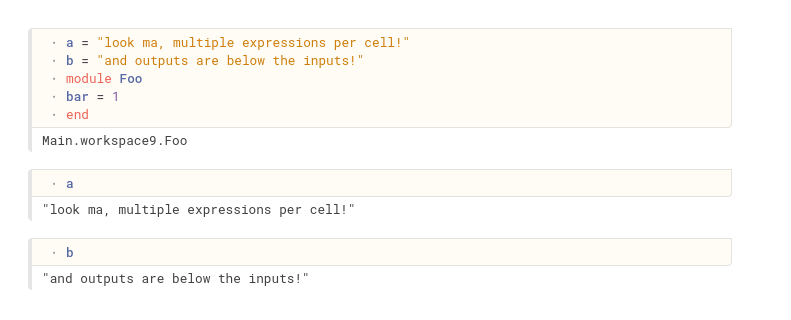

Pluto.jl

This is a fork of [fonsp/Pluto.jl](https://github.com/fonsp/Pluto.jl) with two lines tweaked so that you can have multiple expressions per cell, and outputs appear below inputs.

If I ever get around to it, I'd like to figure out a fix to [this issue](https://github.com/fonsp/Pluto.jl/issues/240) and then implement that here if it's not accepted upstream. 
